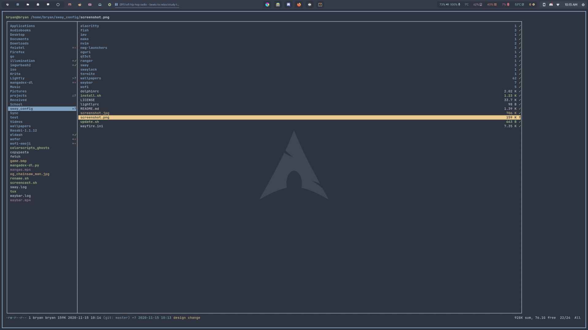

# sway

#### Optional but recommended

- waybar

- azole

- kdeconnect

- [wofer](https://gitlab.com/snakedye/wofer)

- brightnessctl

- grim

- slurp

- swappy

- swaylock-effects

- oguri (for dynamic wallpapers)

- nwg-launchers

- font awesome & nerd-fonts

#### Install config files

The script is written for pacman. If you use another package manager it will install config files but not packages.

1. `git clone https://github.com/snakedye/sway_config.git`

2. `cd sway_config`

3. `./install.sh` (use with the argument `y` for a quick install)

#### Manga library

Dependancies

1. imv

2. fish

3. nwggrid

4. [mangadl-bash](https://github.com/Akianonymus/mangadl-bash)

5. [mangadexdl](https://github.com/frozenpandaman/mangadex-dl) (optionnal)

6. fd (optionnal)

You need to set the `$HOME/.mangas` directory first otherwise the command will fail.

- `addmanga` adds mangas to the .mangas directory. If you have mangadexdl it will also curl the covers.
- `update_mangas` will update your library.
- `update_mangas argv[1] argv[2] ...` will update the titles passed.
- `manga_menu` displays the manga library using using nwggrid.

Wofer also has a manga extension.

#### If you have Qt apps that aren't displayed in the desired theme

1. Install `qt5ct`

2. Open `/etc/environment` in your text editor

3. Insert `QT_QPA_PLATFORMTHEME=qt5ct`

4. Restart sway
